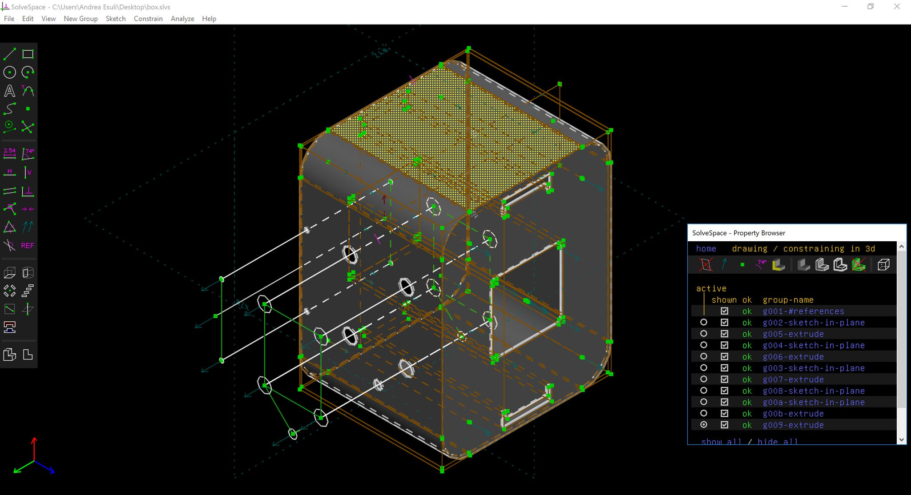
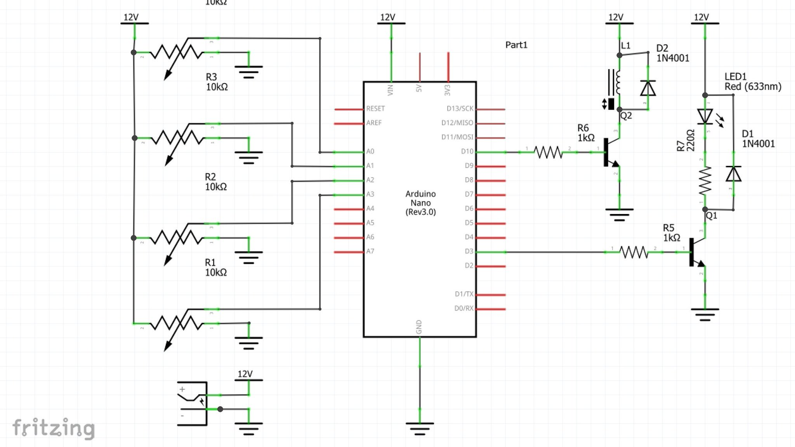
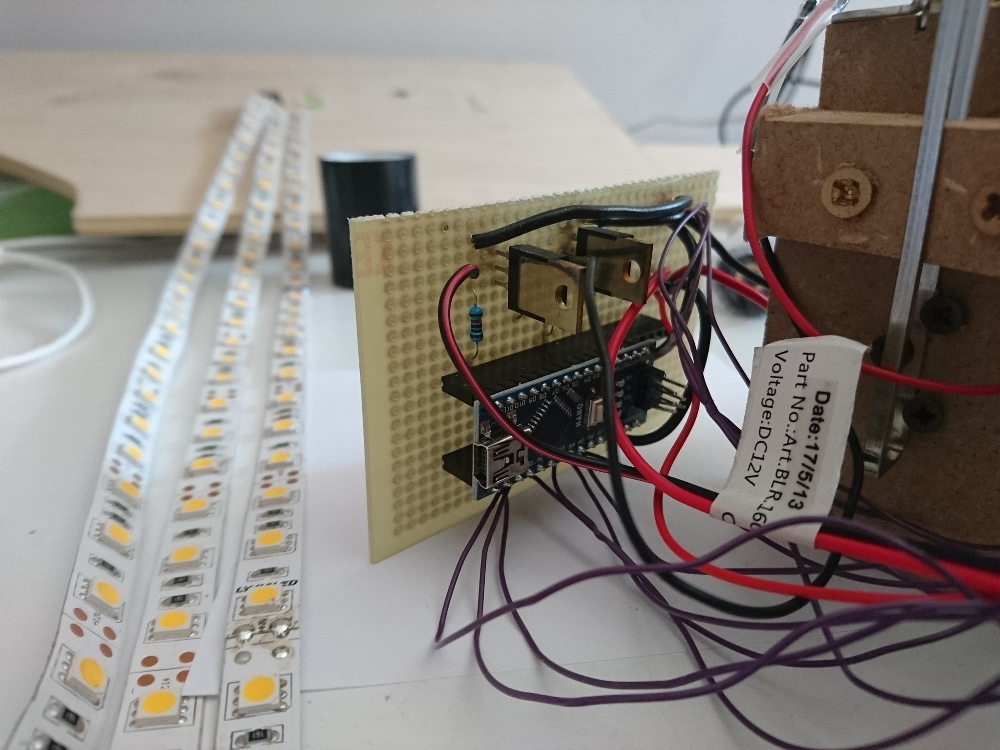
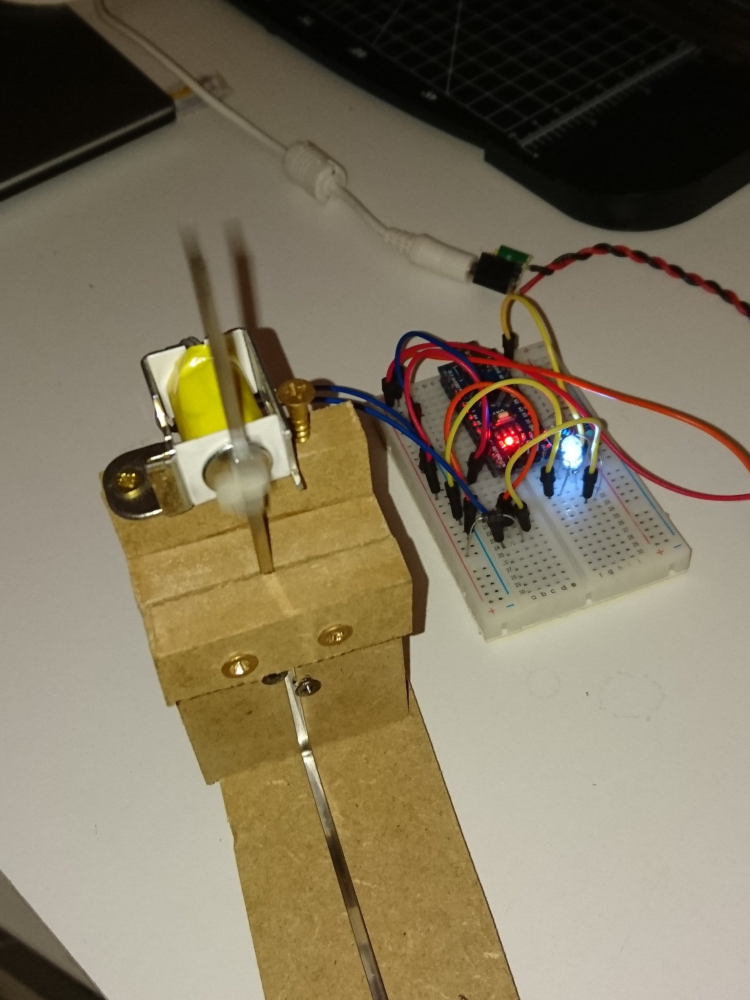

# Slow Motion Machine

A slow motion machine. Works by combining the action of an electromagnet that makes an object vibrate and a high frequency flickering light that "freezes" the motion.

Inspired to the [timeframe](https://github.com/cubic-print/timeframe) from Cubic Print.

I put in my machine four controls that allow me to set:

* the frequency of the electromagnet (to better find a resonating frequency for the object you place in the machine).
* the duty cycle of the electromagnet (intensity of the oscillation).
* the phase shift of the LEDs (speed of the slow motion effect).
* the duty duty cycle of the LEDs (intensity of light).

See it in action:
* Video 1: 
* Video 2: 
* Early prototype: 

---

The box.slvs file is a [Solvespace](http://solvespace.com) 3D model that I made to sketch my idea of the enclosing box.
Then [Cristina Galeotti](http://www.officinegaleotti.it/) ([fb page](https://www.facebook.com/OfficineGaleotti/)) optimized the model to make it printable.
The STL file are made by her.

---

BOM:

 * 1 Arduino Nano
 * 4 10k potentiometers
 * 2 1k resistors
 * 1 1N4001 diode
 * 2 NPN transistors
 * 1 LED strip (NOT programmable ones, which are slow)
 * 1 electromagnet

---

Circuit schema:

---

PCB:

---

Oscillator with circuit on breadboard:

